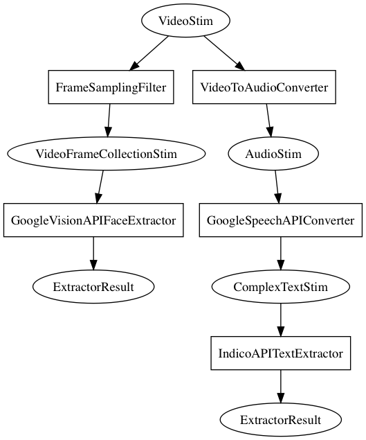

.. include:: _includes/_replacements.rst

Graphs
======

Graph specification
-------------------
To this point, we've been initializing and running our Transformers one at a time, and explicitly passing stimuli to each one. While this works fine, it can get rather verbose in cases where we want to extract a large number of features. It can also be a bit of a pain to appropriately connect Converters to one another when the routing is complicated.

For example, suppose we have a series of videos (perhaps segments of a full-length movie), and we want to extract both visual and speech transcript-based features. Specifically, let's say we want to detect faces in the frames of the video, and also run a sentiment analysis model on a speech transcription extracted from the audio track of the videos. This requires us to do all of the following:

- Convert the video to a series of video frames (i.e., static images), probably with some periodic sampling (there's no point in running face detection on every single frame, since subtitles won't change nearly that fast---we can probably get away with sampling frames as little as twice per second);
- Run face detection on each extracted frame (we'll use Google's Cloud Vision face detection API);
- Extract the audio track from the video;
- Transcribe the audio track to text (we'll use Google's Cloud Speech API for this);
- Run a sentiment analysis model (in this case, using the Indico.io API) on the transcribed text.

The code to do this, with transformations made explicit:

.. code-block:: python
	:caption: Listing 1
	:name: listing-1

	from pliers.stimuli import VideoStim
	from pliers.filters import FrameSamplingFilter
	from pliers.converters import GoogleSpeechAPIConverter
	from pliers.extractors import (IndicoAPITextExtractor, merge_results,
	                               GoogleVisionAPIFaceExtractor)

	segments = ['segment1.mp4', 'segment2.mp4', 'segment3.mp4']
	segments = [VideoStim(s) for s in segments]

	# Sample 2 video frames / second
	frame_filter = FrameSamplingFilter(hertz=2)
	frames = frame_filter.transform(segments)

	# Face extraction
	face_ext = GoogleVisionAPIFaceExtractor()
	face_results = face_ext.transform(frames)

	# Run each image through Google's text detection API
	transcriber = GoogleSpeechAPIConverter()
	transcripts = transcriber.transform(segments)

	# # Apply Indico sentiment analysis extractor
	indico = IndicoAPITextExtractor(models=['sentiment'])
	sentiment_results = indico.transform(transcripts)

	# Combine visual and text-based feature data
	results = face_results + sentiment_results

	# # Merge into a single pandas DF
	df = merge_results(results)

The Graph API
-------------

The above code really isn't that bad--it already features a high level of abstraction (each |Transformer| is initialized and applied in just two lines of code!), and has the advantage of being explicit about every step. Nonetheless, if we want to save ourselves a few dozen keystrokes, we can use pliers' |Graph| API to abbreviate the listing down to just this:

.. code-block:: python
	:caption: Listing 2
	:name: listing-2

	from pliers.graph import Graph
	from pliers.filters import FrameSamplingFilter
	from pliers.extractors import IndicoAPITextExtractor

	# Define nodes
	nodes = [
	    (FrameSamplingFilter(hertz=2), ['GoogleVisionAPIFaceExtractor']),
	    ('GoogleSpeechAPIConverter', [IndicoAPITextExtractor(models=['sentiment'])])
	]

	# Construct and run Graph
	g = Graph(nodes)
	df = g.transform(segments)

Node specification
~~~~~~~~~~~~~~~~~~
:ref:`listing-2` produces exactly the same result as in :ref:`listing-1`. But instead of explicitly initializing and applying each |Transformer| in sequence, all of the important work is done in the compact node specification. A detailed explanation of the node specification format can be found in the :func:`~pliers.graph.Graph.add_nodes` docstring. For present purposes, the key thing to recognize is that each node in the above graph is represented as a tuple with 2 elements. In this case, there are two root nodes--one for image processing (face extraction), the other for speech processing (sentiment analysis on the transcribed text). The first element in each |Node| definition indicates which Transformer to apply at that node. Here, the first node applies a |FrameSamplingFilter|, and the second applies a |GoogleSpeechAPIConverter|.

The second element in each tuple contains any children nodes-—i.e., nodes to which the output of the Transformer specified in the first node are passed. In our case, each node has only one child: the |FrameSamplingFilter| passes its output to the |GoogleVisionAPIFaceExtractor|, and the |GoogleSpeechAPIConverter| passes its output to the |IndicoAPITextExtractor|. However, in principle, the list of children nodes can be arbitrarily large. For example, we could have written:

::

	nodes = [
	    (FrameSamplingFilter(hertz=2),
	    	['GoogleVisionAPIFaceExtractor',
	    	 'ClarifaiAPIExtractor',
	    	 'GoogleVisionAPILabelExtractor'])
	]

In this case, we would have a single root node, and the output of the |FrameSamplingFilter| would be independently passed to three separate extractors--the Google Vision face extractor, the Clarifai object labelling extractor, and the Google Vision label extractor. 

Nesting
#######
We can also nest additional levels by replacing each string value in the child list with another tuple. For example:

::

	nodes = [
	    (FrameSamplingFilter(hertz=2),
	    	[
	    	('GoogleVisionAPITextConverter',
	    		[
	    			IndicoAPITextExtractor(models=['sentiment'])
	    	 	])
	    	 ]
	    )
	]

Here, we're passing video frames to the |GoogleVisionAPITextConverter|, which detects text labels within images. Any resulting |TextStim| objects are then passed onto the |IndicoAPITextExtractor| for sentiment analysis. Using this simple syntax, we can quickly construct Graphs with arbitrarily deep nestings.

Other stuff
###########
There are two other points worth noting about the |Graph| specification. First, note that we don't need to explicitly specify most |Stim| conversion steps, as these will generally be detected and injected automatically (though, laziness aside, it's generally a good idea to be explicit). In :ref:`listing-2`, we never had to specify the |VideoToAudioConverter| that strips the audio track from the input videos; pliers did the work for us implicitly.

Second, observe that we can define nodes using string values rather than initialized |Transformer| objects. For example, in :ref:`listing-2`, instead of passing an initialized ``GoogleVisionAPIFaceExtractor()`` object, we pass the string ``'GoogleVisionAPIFaceExtractor'`` (we could also have passed ``'googlevisionapifaceextractor'``, as the specification is case-insensitive). This only works in cases where we don't need to pass non-default arguments, however.

JSON specification
~~~~~~~~~~~~~~~~~~
A convenient feature of the graph API illustrated in :ref:`listing-2` is that the list of nodes can be easily serialized as plain text. This allows us to conveniently encode the above graph specification as the following JSON:

.. code-block:: json
	:caption: Listing 3
	:name: listing-3

	nodes = {
	    'roots': [
	        {
	            'transformer': 'FrameSamplingConverter',
	            'parameters': {
	                'hertz': 2
	            },
	            'children': [
	                {
	                    'transformer': 'GoogleVisionAPIFaceExtractor'
	                }
	            ]
	        },
	        {
	            'transformer': 'GoogleSpeechAPIConverter',
	            'children': [
	                {
	                    'transformer': 'IndicoAPITextExtractor',
	                    'parameters': {
	                        'models': ['sentiment']
	                    }
	                }
	            ]
	        }
	    ]
	}

We can then construct a |Graph| simply by passing in the path to the JSON file:

::

	graph = Graph(spec='graph_spec.json')

Note one important difference between the Python specification and the JSON specification: we obviously can't serialize the already-initialized |FrameSamplingFilter| in the Python listing as plain text. This means that for Transformers that we want to initialize with non-default arguments, we need to separate the parameters separately, as in the JSON example above.

Plotting
~~~~~~~~

To facilitate understanding and verification of |Graph|\s--which can get complicated in a hurry if a lot of implicit conversion is happening--the |Graph| class provides rudimentary plotting capabilities. Provided graphiz and PyGraphviz are available, calling :py:`graph.draw(filename)` on any initialized |Graph| will generate a simple visual representation of the Graph. For our running example (:ref:`listing-2`), the result looks like this:

